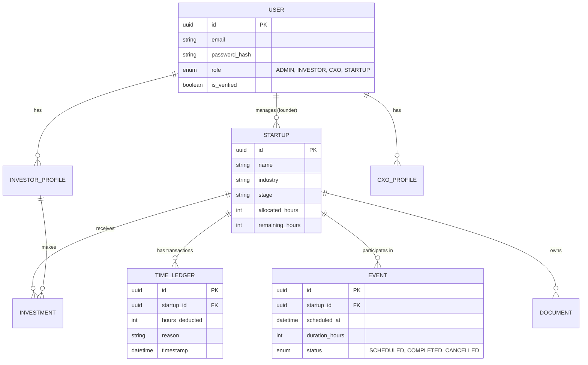

# Bharat Ventures Backend Architecture & System Flow

This document details the backend-exclusive architecture, database schema, and complete operational flows for the Bharat Ventures platform, ensuring an industrial-grade, scalable, and secure system.

## User Review Required

> [!IMPORTANT]  
> Please review the detailed database schema and API workflows below. If the logic for the Time-Bank (Accelerator) and onboarding flows aligns with your business processes, approve this plan so we can begin backend development.

## Open Questions

> [!WARNING]  
> 1. **Authentication:** Should we build a custom JWT-based authentication system from scratch, or integrate an industrial solution like Auth0, AWS Cognito, or Supabase Auth?
> 2. **Document Signing:** For the Accelerator onboarding flow, do you have a preferred e-signature provider API (e.g., DocuSign, HelloSign) we should integrate with?
> 3. **Database:** I am proposing PostgreSQL with Prisma ORM. Please confirm if this meets your requirements.

---

## 1. Backend Architecture

The backend will be built as a **Modular Monolith** using **Node.js, Express, and TypeScript**. This provides the structure of microservices (separated domains) without the operational overhead, making it ideal for a growing industrial platform.

### Tech Stack
- **Framework:** Express.js with TypeScript for strong typing and robust interfaces.
- **Database:** PostgreSQL (Relational integrity is crucial for equity and time-bank tracking).
- **ORM:** Prisma ORM for type-safe database queries and schema management.
- **Caching & Queues:** Redis with BullMQ (for background tasks like generating reports, sending emails, and automated hour deduction).
- **Storage:** AWS S3 (for storing pitch decks, legal documents, and profile images).

### System Modules (Domains)
1. `Auth & Users Module`: Handles RBAC (Role-Based Access Control) for Admins, Investors, CXOs, and Startups.
2. `Startups Module`: Manages profiles, metrics, data rooms, and cap tables.
3. `Investments Module`: Manages investor portfolios, startup funding rounds, and pledges.
4. `Vivachana Module`: Manages CXO profiles, application workflows, and matching.
5. `Accelerator Module`: Manages time-bank ledgers, events, and legal document tracking.

---

## 2. Database Schema (Core Entities)

---

## 3. Complete Operational Flows

### Flow 1: Bharat Accelerator Onboarding & Document Signing
1. **Application:** Startup submits application via API.
2. **Approval:** Admin reviews and updates startup status to `APPROVED`.
3. **Document Generation:** Backend triggers an event to generate standard NDA & Term Sheets (PDFs).
4. **E-Signature:** Integration with DocuSign/HelloSign API sends documents to founders.
5. **Activation:** Upon webhook receipt of successful signatures, backend activates the Startup profile and credits their `allocated_hours` balance.

### Flow 2: The "Time-Bank" Engine (Automatic Hour Deduction)
1. **Scheduling:** An event (e.g., "Consultancy Meeting") is created and linked to a Startup with a specific `duration_hours`. Event status is `SCHEDULED`.
2. **Execution:** Once the meeting concludes, an Admin (or automated system via calendar integration) marks the event as `COMPLETED`.
3. **Background Job:** The `Accelerator Module` queues a BullMQ task.
4. **Transaction:** The worker creates a new record in `TIME_LEDGER` deducting the hours, and updates `remaining_hours` on the `STARTUP` record.
5. **Notification:** If `remaining_hours` falls below a threshold, an email alert is queued to the founder and admin.

### Flow 3: Vivachana (CXO Think-Tank) Application
1. **Application:** CXO submits detailed profile, LinkedIn, and expertise areas. Status is `PENDING`.
2. **Review Pipeline:** Admins can transition status to `INTERVIEWING` -> `ACCEPTED` or `REJECTED`.
3. **Directory Publish:** Once `ACCEPTED`, their profile is synchronized to the public/internal CXO directory cache (Redis) for fast querying by Startups.

### Flow 4: Investor Data Room & Commitment
1. **Verification:** Investor signs up and undergoes KYC/AML checks (Admin manual approval).
2. **Discovery:** Investor browses Startups. Backend serves highly-cached lists of active funding rounds.
3. **Data Room Access:** Investor requests access to a startup's data room (pitch decks on S3). Backend generates secure, time-limited AWS S3 Presigned URLs.
4. **Investment Pledge:** Investor submits a pledge. Backend creates an `INVESTMENT` record (Status: `PENDING_FUNDS`), updating the startup's funding progress bar.

---

## 4. Development Execution Plan

### Phase 1: Infrastructure & Auth
- Initialize TypeScript Express environment.
- Setup PostgreSQL & Prisma. Implement base models.
- Implement Authentication & RBAC middleware.

### Phase 2: Core Domain Logic
- Build the `Startups` and `Users` modules.
- Implement the Accelerator Onboarding API endpoints.

### Phase 3: The Engine & Integrations
- Setup Redis and BullMQ.
- Build the `Accelerator Module` (Time-Bank logic and Event tracking).
- Implement AWS S3 upload logic and document tracking.

### Phase 4: Vivachana & Investor Portals
- Build the CXO application and directory APIs.
- Build the Investor pledge and Data Room APIs.
